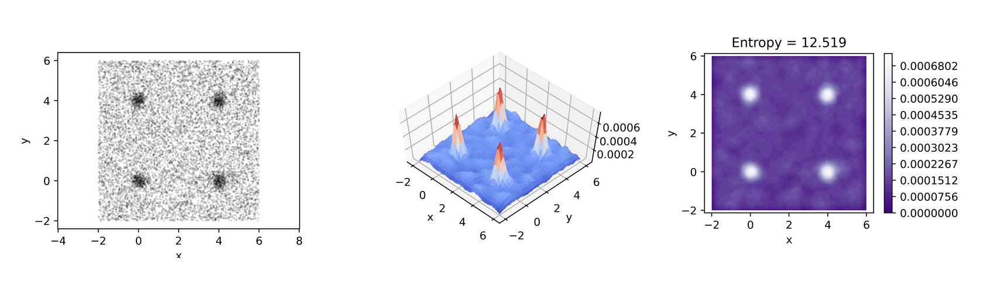

<a href="https://github.com/pedroramaciotti/Cloudtropy">https://github.com/pedroramaciotti/Cloudtropy</a>

Empirical probability mass functions and entropies of N-dimensional clouds of points, as seen in

Onesto, V., M. Romano, F. Gentile, and F. Amato. "Relating the small world coefficient to the entropy of 2D networks and applications in neuromorphic engineering." Journal of Physics Communications 3, no. 9 (2019): 095011.