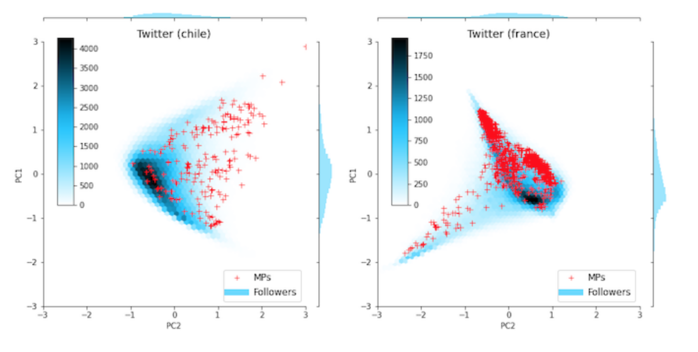

<a href="https://github.com/pedroramaciotti/MDScaling">https://github.com/pedroramaciotti/MDScaling</a>

Multi-dimensional network scaling for python.

Onesto, V., M. Romano, F. Gentile, and F. Amato. "Relating the small world coefficient to the entropy of 2D networks and A python module for the multi-dimensional scaling of networks. MDScaling takes topological data (a network of connected nodes) an produces a multi-dimensional embedding in a geometrical space where distance is related to topological similarity.

Cite us:

*Ramaciotti Morales, P., Cointet, J.-P., & Laborde, P. (2020, December). Your most telling friends: Propagating latent ideological features on Twitter using neighborhood coherence. In 2020 IEEE/ACM International Conference on Advances in Social Networks Analysis and Mining (ASONAM), IEEE.*